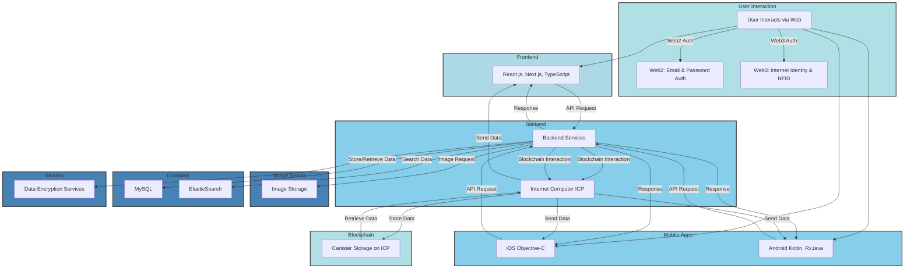
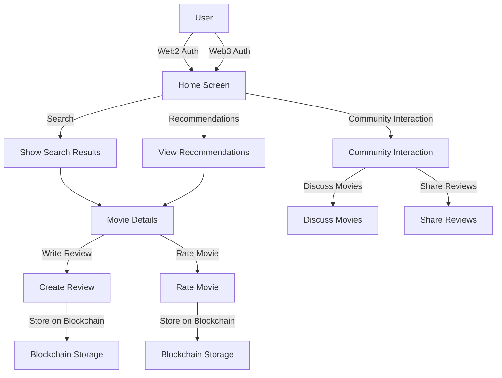

# RatersApp: Discover, Rate, and Review Movies

RatersApp is a SocialFi platform powered by the blockchain, designed for movie lovers. It provides a space to share reviews, ratings, and discover films.

## Overview

### Raters Stack
- **Backend:** PHP (Laravel), Node.js, NestJS, ElasticSearch, MySQL, Nginx
- **iOS:** Objective-C
- **Android:** Kotlin, RxJava, Coroutines, Retrofit, Koin
- **Web:** React.js, Redux, Sagas, Next.js, Vercel
- **Raters Correlation:** Python, Flask

### Infrastructure
- Dedicated Server Hosting, Ubuntu, Cloudflare, Bitbucket, Docker

**Note:** This demo shows the blockchain implementation in the existing RatersApp.

For detailed instructions on contributing, please refer to the README of each repository:

- [Raters Frontend Example](https://github.com/RatersApp/raters-fe-example/blob/main/README.md)

### Ratersapp Architecture Diagram




### Ratersapp User Flow Diagram


## Project Components

### [Raters Canister](https://github.com/RatersApp/canister)
**Raters Canister** provides decentralized management and verification of ratings using ICP canisters.

**Features:**
- Decentralized rating management
- Secure user interactions
- Efficient data storage and retrieval

### [Raters Frontend Example](https://github.com/RatersApp/raters-fe-example)
**Raters Frontend Example** integrates Web3 authorization using Next.js and TypeScript.

# Project Description: Web3 Authorization Integration in RatersApp

For the RatersApp project, Web3 authorization was integrated using various libraries and tools. The primary framework for the application is Next.js, and the project is written in TypeScript. Below are the details of the libraries and their purposes in this integration:

## Repository Information
This repository is a trimmed example implementation of the frontend part of the RatersApp service, demonstrating the milestone implementations within the ICP developer grant framework.


**Installation:**
Clone the repository:
   git clone https://github.com/RatersApp/raters-fe-example.git
   cd raters-fe-example

## Getting Started

First, run the development server:

```bash
npm run dev
# or
yarn dev
```

Open [http://localhost:3000](http://localhost:3000) with your browser to see the result.

You can start editing the page by modifying `pages/index.js`. The page auto-updates as you edit the file.

[API routes](https://nextjs.org/docs/api-routes/introduction) can be accessed on [http://localhost:3000/api/hello](http://localhost:3000/api/hello). This endpoint can be edited in `pages/api/hello.js`.

The `pages/api` directory is mapped to `/api/*`. Files in this directory are treated as [API routes](https://nextjs.org/docs/api-routes/introduction) instead of React pages.

## Learn More

To learn more about Next.js, take a look at the following resources:

- [Next.js Documentation](https://nextjs.org/docs) - learn about Next.js features and API.
- [Learn Next.js](https://nextjs.org/learn) - an interactive Next.js tutorial.

You can check out [the Next.js GitHub repository](https://github.com/vercel/next.js/) - your feedback and contributions are welcome!

## Deploy on Vercel

The easiest way to deploy your Next.js app is to use the [Vercel Platform](https://vercel.com/new?utm_medium=default-template&filter=next.js&utm_source=create-next-app&utm_campaign=create-next-app-readme) from the creators of Next.js.

Check out our [Next.js deployment documentation](https://nextjs.org/docs/deployment) for more details.
 
## License
This project is licensed under the MIT License. See the [LICENSE](https://opensource.org/licenses/MIT) file for details.
