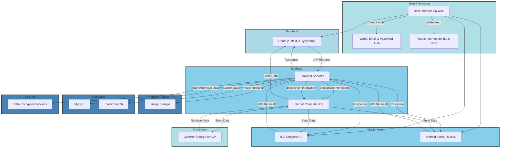
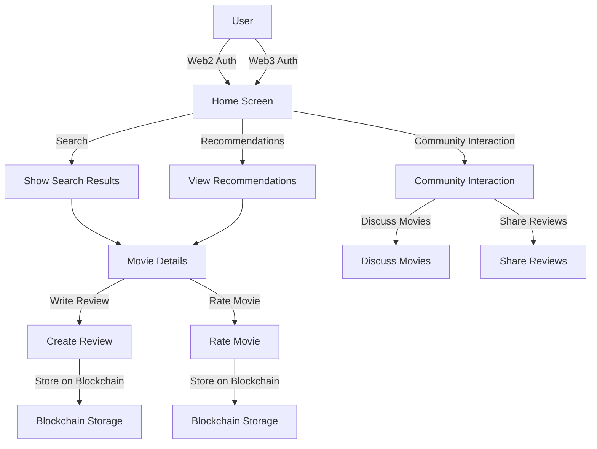

# RatersApp: Discover, Rate, and Review Movies

RatersApp is a SocialFi platform powered by the Internet Computer (ICP) blockchain, designed for movie lovers. It provides a space to share reviews, ratings, and discover films.

## Overview

### Raters Stack
- **Backend:** PHP (Laravel), Node.js, NestJS, ElasticSearch, MySQL, Nginx
- **iOS:** Objective-C
- **Android:** Kotlin, RxJava, Coroutines, Retrofit, Koin
- **Web:** React.js, Redux, Sagas, Next.js, Vercel
- **Raters Correlation:** Python, Flask
- **Blockchain:** Internet Computer (ICP), Canister storage on ICP, Azle core framework
- **Authentication**: NFID, Internet Identity
- **ICP Libraries:** @dfinity/agent, @dfinity/identity, @dfinity/candid, @dfinity/ledger

[**A brief overview of how to log in via NFID or Internet Identity**:](https://www.youtube.com/watch?v=d2m7dn_5Azk)

[](https://www.youtube.com/watch?v=d2m7dn_5Azk)

### Infrastructure
- Dedicated Server Hosting, Ubuntu, Cloudflare, Bitbucket, Docker

**Note:** This demo shows the blockchain implementation in the existing RatersApp.

For detailed instructions on contributing, please refer to the README of each repository:

- [Raters Canister](https://github.com/RatersApp/canister/blob/main/README.md)
- [Raters Backend JS](https://github.com/RatersApp/raters-backend-js/blob/main/README.md)
- [Raters Frontend Example](https://github.com/RatersApp/raters-fe-example/blob/main/README.md)

### Ratersapp Architecture Diagram




### Ratersapp User Flow Diagram


## Sprint Goals and Milestones

### Milestone #1: Research, Preliminary Setup, and Initial Backend Development

#### Understanding NFID and Internet Identity:
- Review NFID and Internet Identity documentation to understand their capabilities, limitations, and integration requirements.
- Identify potential synergies between Ratersapp's existing systems and NFID/Internet Identity.

#### Environment Setup:
- Install and configure necessary development tools, SDKs, and environments specific to NFID and Internet Identity.
- Set up the infrastructure required to deploy Ratersapp canisters on the Internet Computer.

#### Backend Development:
- Begin development of an API interface to facilitate communication between Ratersapp and NFID/Internet Identity.
- Design the database schema to accommodate user-specific identifiers and related information securely.
- Plan the integration of storing ratings on the ICP blockchain, including smart contract development.

#### Frontend Design:
- Create preliminary designs and wireframes for the authentication processes using NFID and Internet Identity.
- Draft mockups for the user interface elements related to the integration, including displaying and interacting with ratings stored on the blockchain.

### Milestone #2: Front-end Integration, Testing, and Security

#### Front-end Integration:
- Develop the user interface components for integrating NFID and Internet Identity authentication into Ratersapp.
- Implement functionality to handle authentication processes.
- Integrate user interfaces for displaying and interacting with ratings stored on the ICP blockchain.

#### Security:
- Implement robust security measures to protect user data during authentication processes.
- Ensure interactions between Ratersapp and NFID/Internet Identity are secure and comply with data privacy best practices.
- Implement security measures for handling ratings stored on the blockchain, including encryption and access controls.

#### Testing and Debugging:
- Conduct comprehensive testing to identify and resolve any issues or bugs.
- Perform compatibility testing across different devices and platforms to ensure a consistent user experience.
- Test the functionality and security of storing and retrieving ratings from the ICP blockchain.

#### Merge of Accounts:
- Develop functionality to allow existing users to connect their accounts with NFID/Internet Identity.
- Automate the process of associating NFID/Internet Identity with user profiles to streamline the transition.

### Milestone #3: Final Integration, Documentation, and Deployment

#### Final Integration:
- Complete the integration of NFID and Internet Identity authentication into Ratersapp.
- Ensure seamless interoperability across all platforms and optimize user flows for a smooth experience.
- Finalize the integration of storing and retrieving ratings from the ICP blockchain.

#### Documentation and Support:
- Prepare detailed user documentation explaining the features and functionalities of the integrated authentication systems.
- Document the process for storing ratings on the ICP blockchain and provide guidelines for users.

#### Deployment:
- Conduct final testing and quality assurance checks to verify the stability and reliability of the integrated systems.
- Deploy the updated version of Ratersapp with NFID and Internet Identity integration to all users.
- Notify users about the new authentication features and the ability to store and access ratings on the ICP blockchain.


## Project Components

### [Raters Canister](https://github.com/RatersApp/canister)
**Raters Canister** provides decentralized management and verification of ratings using ICP canisters.

**Features:**
- Decentralized rating management
- Secure user interactions
- Efficient data storage and retrieval

**Installation:**
1. Clone the repository:
   ```bash
   git clone https://github.com/RatersApp/canister.git
   cd canister
2. Install dependencies:
   ```bash
   npm install
3. Configure the environment:
Edit configuration files as needed.
4. Deploy the canister:
   ```bash
   dfx deploy

### [Raters Backend JS](https://github.com/RatersApp/raters-backend-js)

**Raters Backend JS** focuses on blockchain integration and encryption functionalities using Node.js.

**Features:**
- User authentication and authorization
- CRUD operations for ratings
- API endpoints for various entities
- Middleware for validation and error handling

**Technologies Used:**
- Node.js
- Nest.js
- Jest for testing

**Used Packages:**
- **@dfinity/identity:** Tools for managing decentralized identities.
- **@dfinity/candid:** Type system for defining and validating data types in the ICP ecosystem.
- **@dfinity/agent:** Methods for interacting with ICP canisters.

**Installation:**
1. Clone the repository:
   ```bash   
   git clone https://github.com/RatersApp/raters-backend-js.git
   cd raters-backend-js
3. Install dependencies:
   ```bash   
   npm install
5. Create a .env file in the 'services' directory and add environment variables:
   ```bash   
   CANISTER_HOST=https://ic0.app
   CANISTER_ID=
7. Start the development server:
   ```bash
   npm run start

### [Raters Frontend Example](https://github.com/RatersApp/raters-fe-example)
**Raters Frontend Example** integrates Web3 authorization using Next.js and TypeScript.

# Project Description: Web3 Authorization Integration in RatersApp

For the RatersApp project, Web3 authorization was integrated using various libraries and tools. The primary framework for the application is Next.js, and the project is written in TypeScript. Below are the details of the libraries and their purposes in this integration:

## NFID Integration
- **Library:** `@nfid/embed`
- **Purpose:** This library connects NFID, facilitating authorization and obtaining the principal, public/private keys, and wallet address.

## ICP Integration
- **Authorization Library:** `@dfinity/identity`
- **Community Hook Library:** `@ic-use-internet-identity`
- **Purpose:** This custom community library integrates a hook for handling authorization within React applications.

## Wallet Address Retrieval
- **Library:** `@dfinity/ledger`
- **Method Used:** `fromPrincipal`
- **Purpose:** This method retrieves the wallet address for both NFID and ICP methods.

## Detailed Description
To integrate Web3 authorization into RatersApp, the `@nfid/embed` library was used for connecting NFID, setting up the authorization, and extracting necessary cryptographic keys (principal, public/private keys) and the wallet address.

For integrating Internet Computer Protocol (ICP) authorization, `@dfinity/identity` was employed for basic authorization functionalities. Additionally, a custom community library `@ic-use-internet-identity` was utilized to provide a convenient hook for incorporating ICP authorization seamlessly into the React component structure of the application.

To ensure compatibility and retrieve the wallet addresses required for transactions and further operations, the `@dfinity/ledger` library was used. Specifically, the `fromPrincipal` method was crucial for obtaining the wallet address corresponding to the principal obtained from both NFID and ICP integrations.

## Repository Information
This repository is a trimmed example implementation of the frontend part of the RatersApp service, demonstrating the milestone implementations within the ICP developer grant framework.


**Installation:**
Clone the repository:
   git clone https://github.com/RatersApp/raters-fe-example.git
   cd raters-fe-example

## Getting Started

First, run the development server:

```bash
npm run dev
# or
yarn dev
```

Open [http://localhost:3000](http://localhost:3000) with your browser to see the result.

You can start editing the page by modifying `pages/index.js`. The page auto-updates as you edit the file.

[API routes](https://nextjs.org/docs/api-routes/introduction) can be accessed on [http://localhost:3000/api/hello](http://localhost:3000/api/hello). This endpoint can be edited in `pages/api/hello.js`.

The `pages/api` directory is mapped to `/api/*`. Files in this directory are treated as [API routes](https://nextjs.org/docs/api-routes/introduction) instead of React pages.

## Learn More

To learn more about Next.js, take a look at the following resources:

- [Next.js Documentation](https://nextjs.org/docs) - learn about Next.js features and API.
- [Learn Next.js](https://nextjs.org/learn) - an interactive Next.js tutorial.

You can check out [the Next.js GitHub repository](https://github.com/vercel/next.js/) - your feedback and contributions are welcome!

## Deploy on Vercel

The easiest way to deploy your Next.js app is to use the [Vercel Platform](https://vercel.com/new?utm_medium=default-template&filter=next.js&utm_source=create-next-app&utm_campaign=create-next-app-readme) from the creators of Next.js.

Check out our [Next.js deployment documentation](https://nextjs.org/docs/deployment) for more details.
 
## License
This project is licensed under the MIT License. See the [LICENSE](https://opensource.org/licenses/MIT) file for details.
